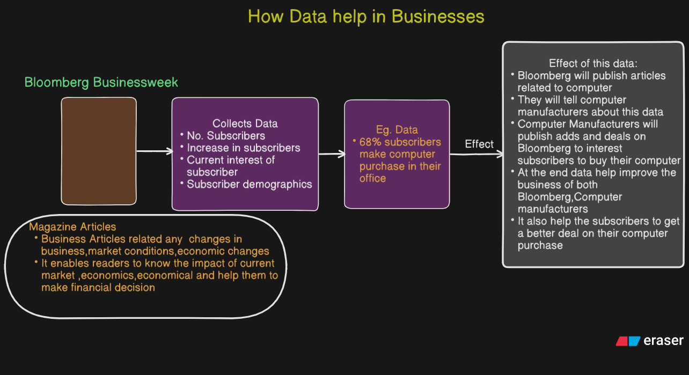
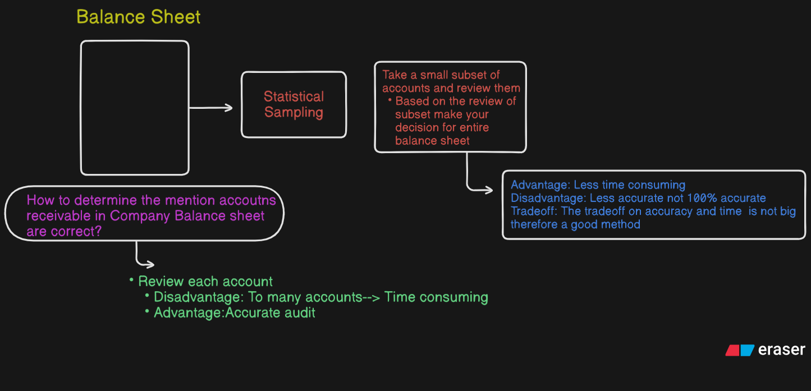
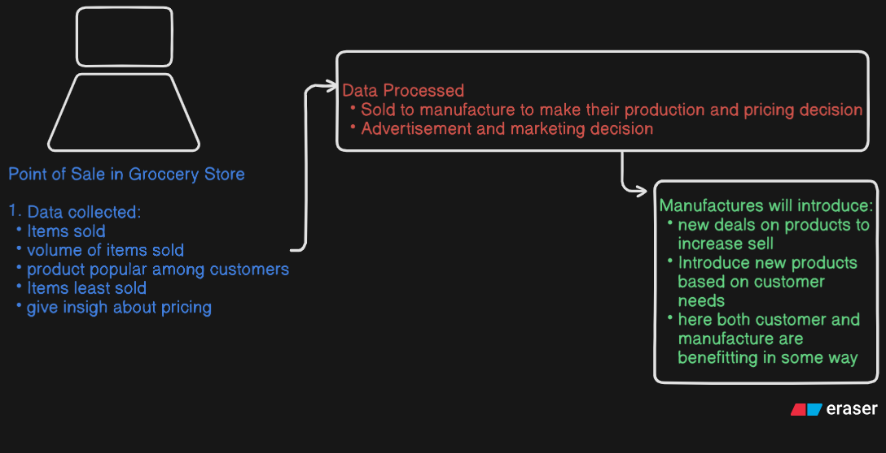
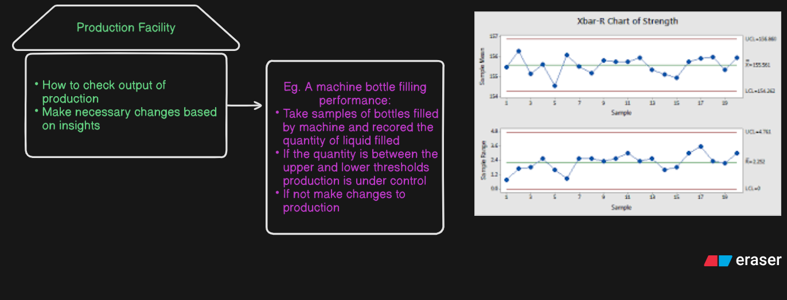
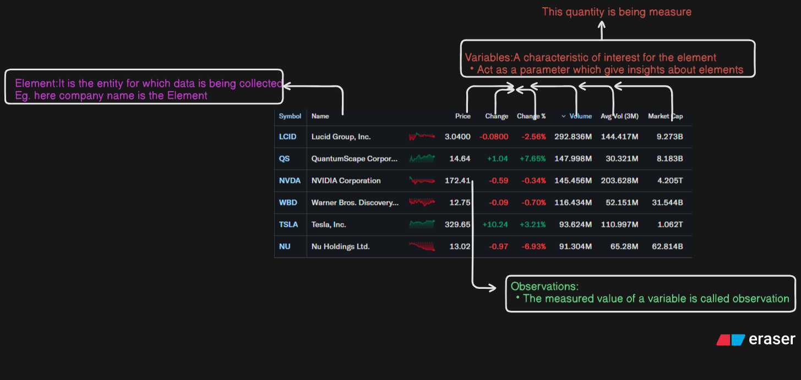
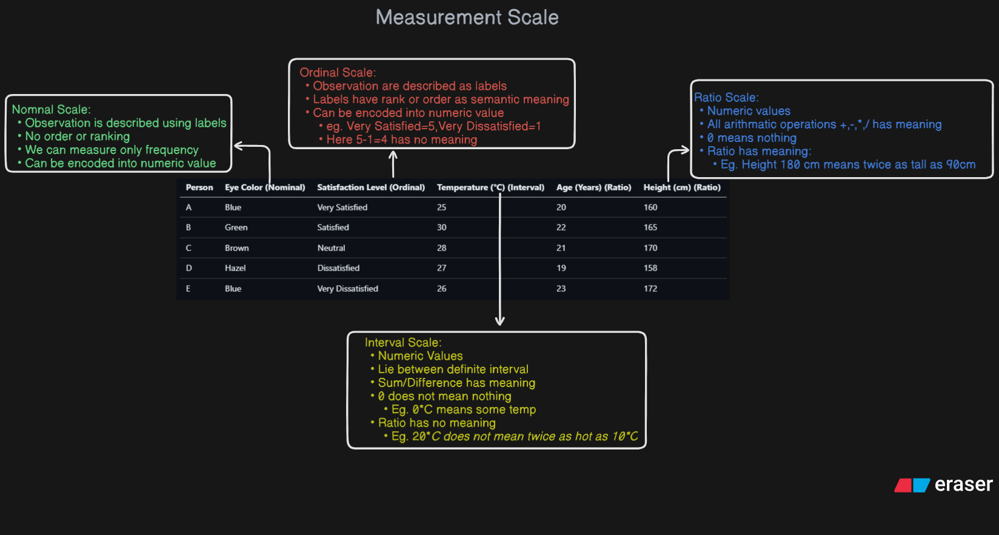

# **Lesson-1:Data and Statistics**

## **What is statistics?**

- Statistics is the art and science of `collecting,organising,analyzing,interpreting,presenting` **data**

## **Statistics in Practice**

## **Application of Statistic in Business and Economies**

### 1. Accounting

### 2. Marketing

### 3. Production

## **What is Data?**

- **Data**: It is the facts and figures that is being _collected,organised,analysed,interpreted and presented_
- **Dataset**:The data collected for a particular study is called the **dataset of the Study**

### Other terms related to Data

---

## **Measurement Scale**

### 🧠 Notes: Types of Measurement Scales

#### 1. **Nominal Scale (Qualitative / Categorical)**

- **Definition**: Labels or names used to identify an attribute or category.
- **Characteristics**:

  - No **order** or **ranking**.
  - Cannot perform mathematical operations.
  - Only **frequency** counts make sense.

- **Examples**: Eye color, Gender, Blood group, Marital status.
- **In the Table**: _Eye Color_ is nominal — "Blue", "Brown", etc., have no inherent order.

---

#### 2. **Ordinal Scale (Ranked / Ordered Categories)**

- **Definition**: Categories with a meaningful order, but the intervals between them are not equal or known.
- **Characteristics**:

  - Values can be **ranked**.
  - Differences between categories are not **quantifiable**.
  - You cannot do arithmetic operations like addition.

- **Examples**: Satisfaction level, Education level (e.g., High School < College < PhD).
- **In the Table**: _Satisfaction Level_ — from "Very Dissatisfied" to "Very Satisfied".

---

#### 3. **Interval Scale (Numeric, Equal Intervals but No True Zero)**

- **Definition**: Ordered numeric data with **equal intervals**, but no **absolute zero**.
- **Characteristics**:

  - Can add/subtract values.
  - Cannot multiply/divide meaningfully.
  - Zero doesn’t mean absence of the quantity.

- **Examples**: Temperature in Celsius or Fahrenheit, IQ scores, Calendar years.
- **In the Table**: _Temperature (°C)_ — 0°C doesn't mean no temperature.

---

#### 4. **Ratio Scale (Numeric with Absolute Zero)**

- **Definition**: Ordered, equal intervals, and has a **true zero** point.
- **Characteristics**:

  - All mathematical operations possible: add, subtract, multiply, divide.
  - Zero represents **absence** of the quantity.

- **Examples**: Age, Height, Weight, Income, Distance.
- **In the Table**: _Age_ and _Height_ — both start at 0, and comparisons like "twice as tall" are meaningful.

---

### Summary Table of Characteristics:

| Scale    | Ordered? | Equal Intervals? | True Zero? | Example             |
| -------- | -------- | ---------------- | ---------- | ------------------- |
| Nominal  | ❌       | ❌               | ❌         | Eye color, Gender   |
| Ordinal  | ✅       | ❌               | ❌         | Satisfaction level  |
| Interval | ✅       | ✅               | ❌         | Temperature (°C)    |
| Ratio    | ✅       | ✅               | ✅         | Age, Height, Weight |

### ✅ **1. Can We Numerically Represent Nominal and Ordinal Scales?**

### 🔹 **Nominal Scale → Yes, using _Label Encoding_ or _One-Hot Encoding_**

- **Purpose**: Machine learning models work with numbers, so we must convert text (e.g., "Red", "Blue") into numeric form.

### 🔸 **Encoding Methods**:

#### a) **Label Encoding** (Assign arbitrary numbers)

| Eye Color | Label |
| --------- | ----- |
| Blue      | 0     |
| Green     | 1     |
| Brown     | 2     |

- **⚠️ Note**: Label encoding **may mislead models** into thinking there’s order where none exists.

#### b) **One-Hot Encoding** (Binary vector for each category)

| Eye Color | Blue | Green | Brown |
| --------- | ---- | ----- | ----- |
| Blue      | 1    | 0     | 0     |
| Green     | 0    | 1     | 0     |

- **✅ Best for nominal** variables with no order.

---

### 🔹 **Ordinal Scale → Yes, using _Ordinal Encoding_**

- Since **order matters**, we can use **label encoding** that **preserves order**.

#### Example:

| Satisfaction Level | Ordinal Encoding |
| ------------------ | ---------------- |
| Very Dissatisfied  | 1                |
| Dissatisfied       | 2                |
| Neutral            | 3                |
| Satisfied          | 4                |
| Very Satisfied     | 5                |

- ✅ Works well when order matters but **differences are not equal** (e.g., difference between 3 and 4 may not be same as between 1 and 2).

---

### ✅ **2. Difference Between Interval and Ratio Scale with Simple Analogy**

### 🧊 Analogy: **Temperature vs. Age**

| Feature                  | Interval Scale (Temperature in °C)    | Ratio Scale (Age in Years)      |
| ------------------------ | ------------------------------------- | ------------------------------- |
| Has order?               | ✅                                    | ✅                              |
| Equal intervals?         | ✅                                    | ✅                              |
| True zero?               | ❌ (0°C is not "no temperature")      | ✅ (0 years = no age)           |
| Can say “twice as much”? | ❌ (20°C is not twice as hot as 10°C) | ✅ (20 years is twice 10 years) |

---

### 🔁 **Key Differences Summarized**:

| Feature                          | Interval Scale         | Ratio Scale                   |
| -------------------------------- | ---------------------- | ----------------------------- |
| Absolute zero                    | ❌ No true zero        | ✅ Has true zero              |
| Multiplicative comparison (×, ÷) | ❌ Not valid           | ✅ Valid (e.g., double, half) |
| Example                          | Temperature in °C or F | Weight, Age, Height, Distance |
| Add/Subtract                     | ✅ Yes                 | ✅ Yes                        |
| Multiply/Divide                  | ❌ No                  | ✅ Yes                        |

---

### 🔁 Quick Real-Life Example:

- **Interval**: You can't say "30°C is twice as hot as 15°C" — heat perception isn't linear, and 0°C isn't the absence of temperature.
- **Ratio**: You **can** say "a 20-year-old is twice as old as a 10-year-old" — because age has a meaningful zero point.

---

